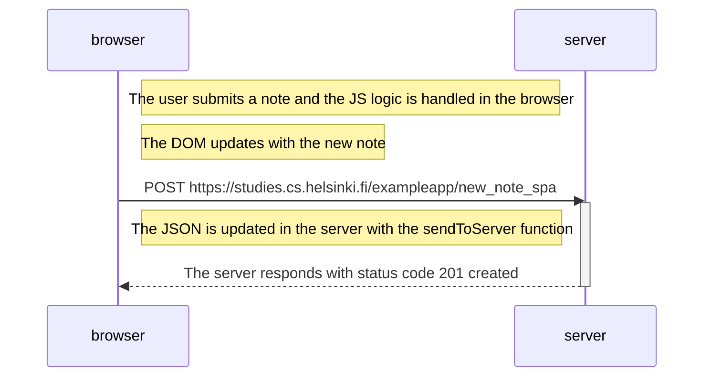

```mermaid
sequenceDiagram
    participant browser
    participant server

    Note right of browser: The user submits a note and the JS logic is handled in the browser
    Note right of browser: The DOM updates with the new note
    browser->>server: POST https://studies.cs.helsinki.fi/exampleapp/new_note_spa

    activate server
    Note left of server: The JSON is updated in the server with the sendToServer function
    server-->>browser: The server responds with status code 201 created
    deactivate server

```

